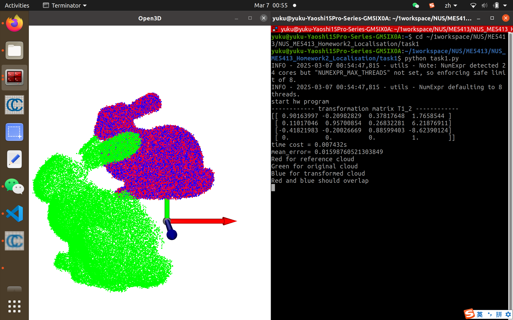
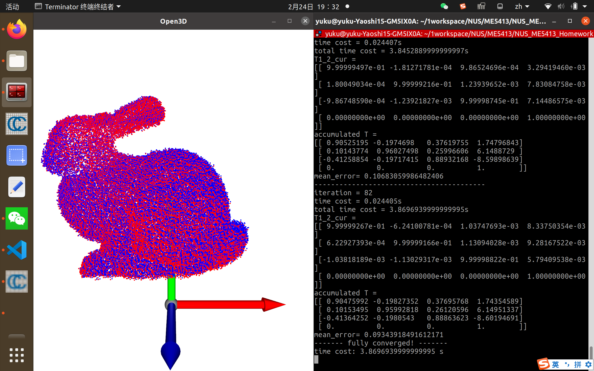
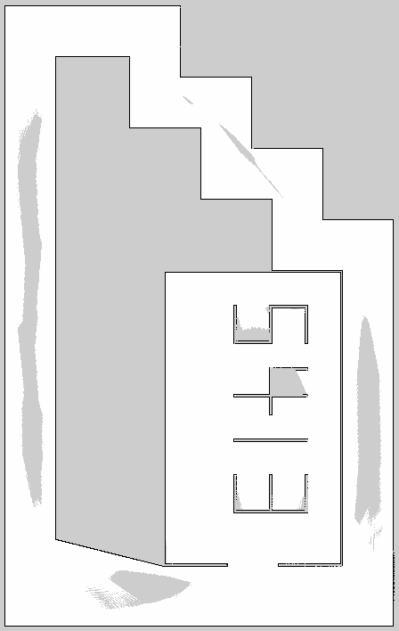
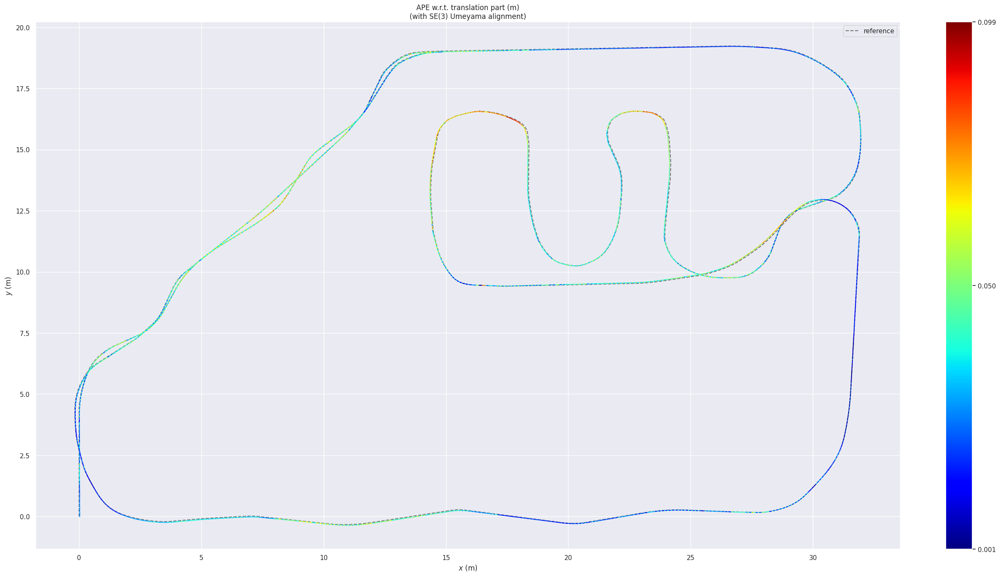
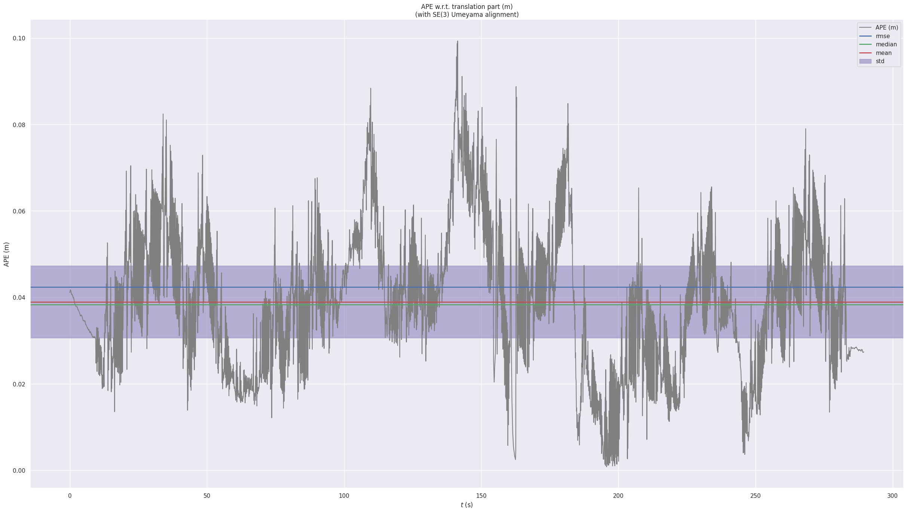

# NUS_ME5413_Homework2_Localisation

## Task 1

### Introduction

The solution for Task 1 of the ME5413: Autonomous Mobile Robot course, focuses on __Point Cloud Registration__ using the __Iterative Closest Point (ICP)__ algorithm. The primary objective is to implement both known and unknown correspondence versions of ICP to align two 3D point clouds.

### Objective

The aim of Task 1 is to implement the ICP algorithm in Python to achieve accurate point cloud registration. The task is divided into two parts:

1. __Task 1.1__ - Implement ICP with known correspondence using SVD-based alignment.

2. __Task 1.2__ - Extend the ICP algorithm to handle unknown correspondences and iteratively refine the alignment until convergence.

### Folder Structure
```
NUS_ME5413_Homework2_Localisation/task1
├── student_data
│   └── student_data_65     # Sample point cloud files used for testing and validation.
│       ├── bunny1.ply
│       └── bunny2.ply
├── task1_ori.py
└── task1.py                # Python script containing the implementation of the ICP algorithm.
```

### How to Run

Clone the repository:

```
git clone https://github.com/YukiKuma111/NUS_ME5413_Homework2_Localisation.git
cd NUS_ME5413_Homework2_Localisation/task1/
```

#### 1. With Known Correspondence:

```
python task1.py
```
This will run the `solve_icp_with_known_correspondence` function and display the results.


#### 2. Without Known Correspondence:

Uncomment the corresponding lines in `main()`:
```
# Comment line 145
# solve_icp_with_known_correspondence(points1, points2)
# Uncomment line 147
solve_icp_without_known_correspondence(points1, points2, n_iter=30, threshold=0.1)
```

Then run:
```
python task1.py
```
This will run the `solve_icp_without_known_correspondence` function and display the results.


### Task Description
#### Task 1.1: ICP with Known Correspondence

 - __Objective:__ Implement the SVD-based ICP algorithm assuming point correspondences are known.

 - __Steps:__
    1. Compute the centroids of the two point clouds.
    2. Subtract the centroids from the points to center the clouds.
    3. Compute the covariance matrix and perform Singular Value Decomposition (SVD).
    4. Calculate the rotation and translation that aligns the point clouds.
    5. Apply the transformation and visualize the results.

#### Task 1.2: ICP without Known Correspondence

 - __Objective:__ Implement ICP where point correspondences are unknown and iteratively refine alignment.
 - __Steps:__
    1. For each iteration:
         - Find nearest neighbors to establish correspondences.
         - Use the known correspondence ICP method to compute the transformation.
         - Apply the transformation and update the point cloud.
         - Compute the mean error and check for convergence.
    2. Terminate upon reaching convergence criteria or after a set number of iterations.

### Results

For both parts:

- __Quantitative:__
     - Final accumulated transformation matrix.
     - Mean error between point clouds.
     - Total time cost.

 - __Qualitative:__
     - Visualization of initial, intermediate, and final point clouds.
     - Demonstration of the iterative process for unknown correspondence.

### Observations

The __ICP with known correspondence__ provides fast and accurate alignment since the correspondence is explicitly given.
The __ICP without known correspondence__ highlights the importance of good initial positioning and may require more iterations to converge.

### Conclusion

Through this task, the complexities of point cloud registration using the ICP method were explored. While known correspondence simplifies the problem, real-world applications often require iterative refinement due to unknown correspondences. This task also demonstrated the significance of convergence thresholds and iteration limits for achieving precise alignment.

## Task 2

### Introduction

This repository contains the solution for Task 2 of the ME5413 Homework 2 assignment, which involves performing 2D SLAM using Google Cartographer on a ROS Noetic environment. The simulated robot used is a “Jackal” Unmanned Ground Vehicle equipped with an IMU, a 2D LiDAR (Sick TIM551), and a 3D LiDAR (Velodyne VLP16). The sensor data is provided in a ROS bag file (`task2.bag`). The performance of the SLAM system is evaluated using the evo tool by comparing the generated trajectory against ground truth data.

### Prerequisites

 - Ubuntu 20.04
 - ROS Noetic
 - Google Cartographer ROS
 - evo (for evaluation)
 - tmux

Ensure that Cartographer, evo and tmux are correctly installed:

[Cartographer Installation Guide](https://google-cartographer-ros.readthedocs.io/en/latest/compilation.html)

[evo Installation Guide](https://github.com/MichaelGrupp/evo?tab=readme-ov-file#installation--upgrade)

```
sudo apt-get install tmux
```

### Folder Structure
```
.
├── catkin_ws
│   └── src
├── run_task2.bash
└── task2
    └── task2.bag
```

### How to Run

1. Clone the repository:

    ```
    git clone https://github.com/YukiKuma111/NUS_ME5413_Homework2_Localisation.git
    cd NUS_ME5413_Homework2_Localisation/task2/
    ```
    If you do not need large file task2.bag, please use the following command:
    ```
    GIT_LFS_SKIP_SMUDGE=1 git clone https://github.com/YukiKuma111/NUS_ME5413_Homework2_Localisation.git
    ```

2. Ensure `run_task2.bash` has execution permissions:

    ```
    chmod +x run_task2.bash
    ```

3. Run the script:

    ```
    bash run_task2.bash
    ```

This script will:

 - Launch roscore and set simulated time.
 - Compile the workspace and start Cartographer.
 - Play the ROS bag file (`task2.bag`).
 - Record the SLAM process into a new ROS bag.
 - Save the generated map as a pgm file and a yaml file.
 - Evaluate SLAM performance using the evo tool and save the results as a zip.

### Tuning

In configuration file [`jackal_robot.lua`](./task2/catkin_ws/install_isolated/share/cartographer_ros/configuration_files/jackal_robot_2d.lua), there are two tuned parameters assist Cartographer calculate a significant great output:

 - TRAJECTORY_BUILDER_2D.use_online_correlative_scan_matching
 - TRAJECTORY_BUILDER_2D.submaps.num_range_data





### Future Work

 - [x] 2D SLAM
 - [ ] 3D SLAM
 - [ ] Adjust 3D parameters
 